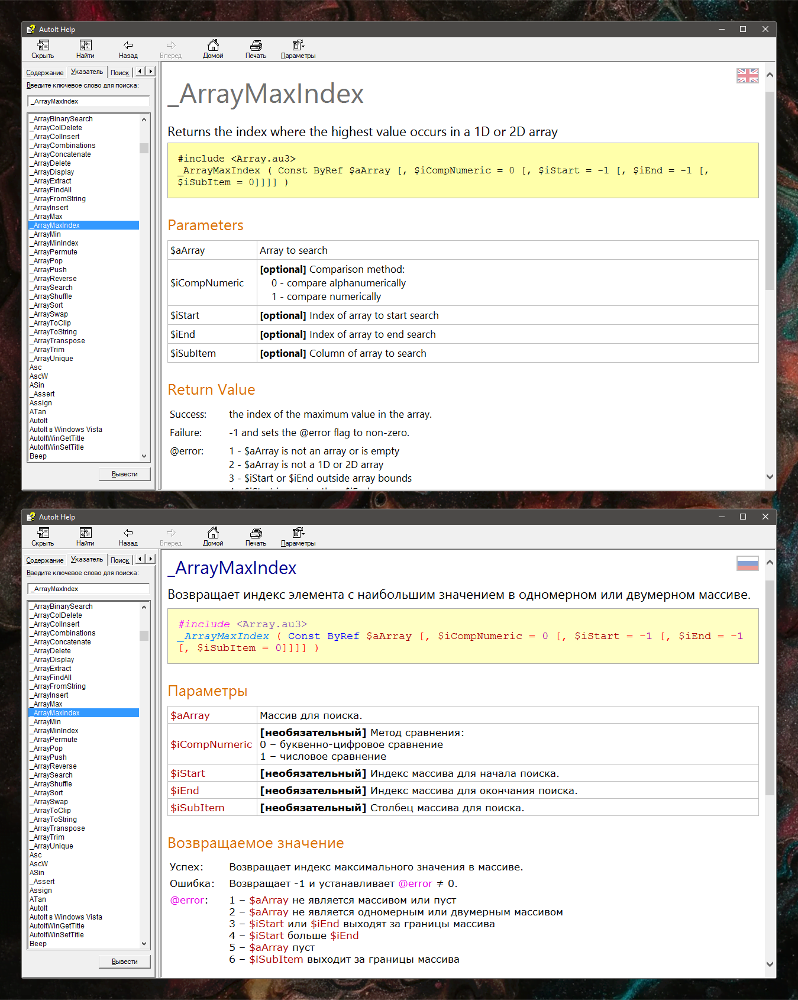
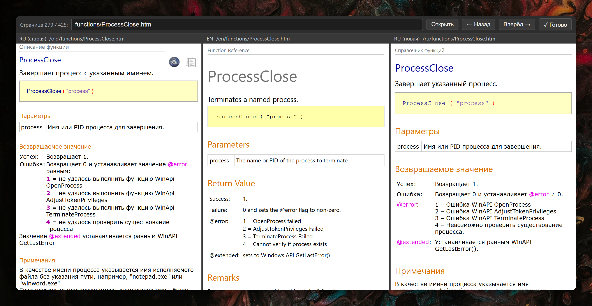
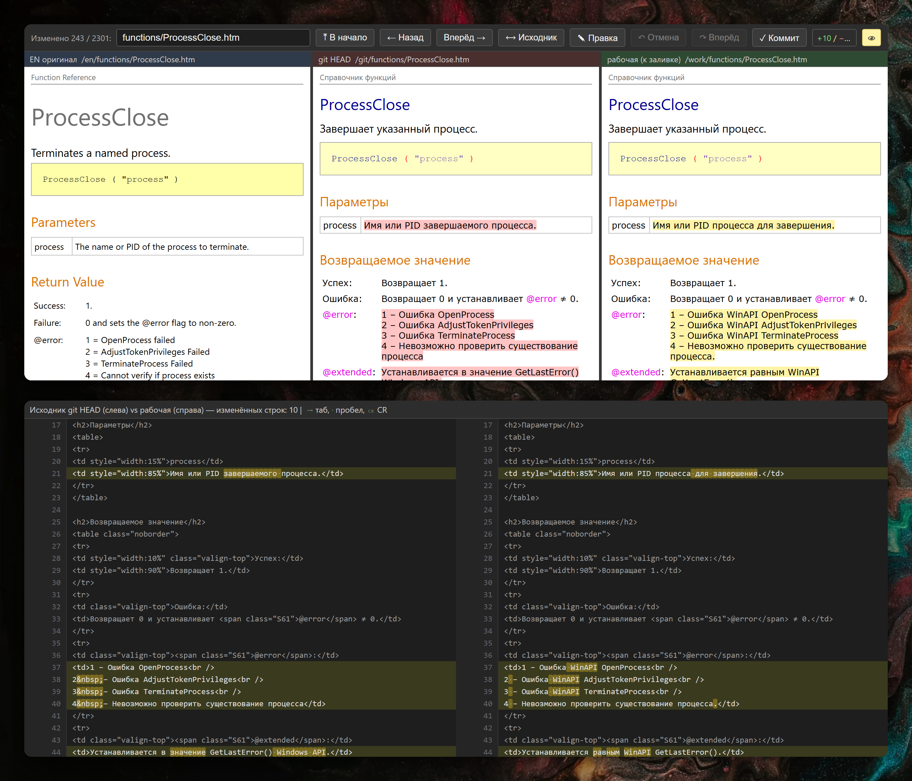

#  AutoIT Help RUS

     
     

Русский перевод официальной справки AutoIT v3.3.18.0.

## Что сделано

- Переведены все 3919 страниц справки: описания функций, параметры, возвращаемые значения, примечания.
- Переведены оглавление, индекс, примеры кода и комментарии в них, история изменений.
- Фича - кнопка флаг РУС/ENG на каждой странице, меняет перевод на оригинал в один клик.
- Примеры кода и сигнатуры функций сохранили подсветку синтаксиса, как в оригинале.
- Имена функций в примерах стали ссылками на их страницы.
- Единый стиль и терминология по всему корпусу. Глоссарий взят из старой русской справки, спасибо AZJIO.

Скачать последнюю версию [AutoIt_ru.chm](https://github.com/MarkovTrue/AutoitHelpRUS/releases/latest/download/AutoIt_ru.chm). Список [релизов](https://github.com/MarkovTrue/AutoitHelpRUS/releases).

## Как сделано

Переводить такой объём вручную не реально. Поэтому собран конвейер: скрипты делают рутину, нейросеть отвечает за текст, а я за контроль качества.

Этапы простыми словами:

1. **Разбор** 
Каждую английскую страницу режем на смысловые блоки и складываем в JSON-файлы, так текст отделён от вёрстки.

2. **Словарь повторов** 
Около 40% текста справки это одни и те же фразы и термины. Их переводим один раз в общий словарь. Туда же попали 4272 типовых комментария из примеров кода.

3. **Перевод** 
Остальные блоки переводит нейросеть по строгим правилам стиля:
   - Единый глоссарий терминов, пример: `handle` - дескриптор, `array` - массив, и т.д.
   - Деловой тон на «вы», без канцелярита, пример: `происходит` вместо `осуществляется`.
   - Пплюс мягкость оригинала, пример: `may` - может, `usually` - обычно.
   - Возвращаемые значения начинаются с глагола, привычное наследие русской справки.

   Контекст для перевода собирается из нескольких источников:
   - **Старая русская справка AZJIO** - как эталон терминологии и формулировок заголовков.
   - **Кодовая база** - тело функции и её родной комментарий. Для пользовательских функций UDF это главный источник смысла.
   - **Сайт MSDN** - для функций обёрток над WinAPI, смысл берём из описания самой Win32-функции.
   - **Пользовательские патчи** - ручное редактирование страниц хранятся отдельными патчами, поэтому повторная генерация их не затирает.

4. **Сборка** 
Скрипт берёт английскую страницу, заменяет блоки на русские, заново раскрашивает синтаксис в примерах, чинит ссылки и оформление.

5. **Глобальные патчи вёрстки** 
Унификация смысловых и визуальных расхождений оригинальной справки. Например общий шаблон для таблиц, подсветка кода в теле описания, одинаковое оформление параметров и констант.

6. **Упаковка в CHM** 
Английское зеркало для кнопки РУС/ENG, штамп версии и компиляция через `hhc.exe`.

## Контроль изменений

Самое неприятное в массовом переводе - тихие регрессии. Поправил скрипт, пересобрал всё, и неожиданная часть страниц откатилась/отвалилась/сломала верстку/заплакала/позвонила маме/подала в суд/спалила любовницу жене! Поэтому любая правка у меня сверяется с английским оригиналом, со старым русским переводом и с тем, что уже лежит в GIT.

### Утилита SplitView

   
  старая RU справка | EN оригинал | новый RU перевод

Локальный сервер показывает одну страницу в три колонки. Так удобно листать раздел подряд и сразу видеть, где новый перевод разошёлся со старым. Проверенная страница отмечается кнопкой «Готово», чтобы второй раз не попадалась и была возможность работы в несколько сессий.

### Утилита GitView

   
  оригинал | GIT версия | рабочая копия

Вторая утилита берёт из GIT список изменённых страниц и показывает каждую тоже в три колонки. Изменённые блоки подсвечены прямо на странице, удалённое розовым, новое жёлтым. На скрине видно, как переписались параметры и примечания у `ProcessClose`. Ниже построчный diff исходника.

- Кнопка «Исходник» переключает на построчный diff HTML. Так табы, пробелы и переносы строк видны явно.
- Клик по блоку открывает редактор. Правка сама пишется туда, где живёт текст: в перевод страницы, в общий словарь или в патч. Страница тут же пересобирается. Если правка в общем словаре, пересобираются все страницы с этим блоком.
- Кнопка «Коммит» пересобирает страницу и проверяет баланс тегов. Если разметка поехала, коммита не будет.
- Правки, где поменялся только регистр или пробелы, отдельный скрипт собирает в один общий коммит, чтобы в истории они не мешались с настоящими.

### Автоматические проверки

| Проверка | Что делает |
|---|---|
| Гейт регрессии | Считает русские слова на каждой странице и сравнивает с GIT. Если пропало больше 15%, страница восстанавливается из GIT и больше не перегенерируется. Запускается после каждой полной сборки. |
| Валидатор перевода | Проверяет правила стиля до записи страницы, с ошибкой страница не запишется. После сборки ищет блоки, которые остались на английском. |
| Сверка EN | Нейросеть иногда пишет английский исходник «по памяти», и тогда перевод молча затерается. Эта проверка такие блоки находит. |
| Идемпотентность | Повторный прогон на готовой странице не должен ничего менять. |
| Оглавление | Название в оглавлении и индексе должно совпадать с заголовком страницы. |

На случай новой версии AutoIt есть скрипт миграции. Он сравнит старый и новый английский текст по блокам и пометит изменённые как устаревшие, перевести останется только их.

## Грабли

- `hhc.exe` читает заголовки страниц в кодировке проекта и на UTF-8 не смотрит. Поэтому рабочая копия живёт в UTF-8, а при сборке перекодируется в cp1251. Символы, которых в cp1251 нет, уходят в HTML-сущности. Ещё он не любит пробелы и `&` в именах файлов, пришлось переименовывать и чинить ссылки.
- 107 страниц со структурами WinAPI (`$tagRECT`, `$tagNMHDR` и прочие) терялись при распаковке CHM из-за `$` в имени файла.
- Встроенный просмотрщик CHM работает на движке IE7, так что скрипт переключателя написан по старинке. Английское зеркало лежит внутри CHM, и файл из-за этого вырос почти вдвое.
- Изначально ручные перепатчи делались на готовом HTML. Полная пересборка молча откатывала такие изменения. Так появился гейт регрессии и отдельное хранение пользовательских патчей

## История

Мне стало любопытно, за какое время получится организовать систему и перевести справку из нескольких тысяч страниц.
- Основная база и логика была продумана и сделана за 3 дня.
- Ещё пара дней доводка системы и поиск проблем.
- 2 недели исправлений и больше 2300 обновлённых страниц между версиями 1.01 и 1.02.
- В остальном шлифовкой можно заниматься бесконечно.

В оригинальной справке, особенно у пользовательских функций, оформление не всегда следует шаблону.
Авторы UDF не всегда внятно объясняют, что их функция делает, поэтому очень строгий перевод отпал сам собой.

Русский вариант сделан более системно, по оформлению и по шаблону описания, чем оригинал.
Киллер фича, которая снимает с меня всю ответственность - это кнопка, которая позволяет быстро увидеть оригинал страницы)
В любом случае перевод в основном очень достойный, современные нейросети топчик.

Огромная благодарность автору перевода старой русской справки AZJIO, его работа взята за основу.

В этой репе не будет скриптов и инструментов для сборки.
Если комьюнити AutoIT будет активно, что мало вероятно в 2026 году, то по возможности будут выкладываться обновления.

## Поддержка

Правки и предложения приветствуются.
Отсыпать благодарности можно сюда [CloudTips](https://pay.cloudtips.ru/p/c4a97b44).

## Ссылки

- [Русское сообщество AutoIT](https://autoit-script.ru/)
- [Домашняя страница AutoIT](https://www.autoitscript.com/site/)
